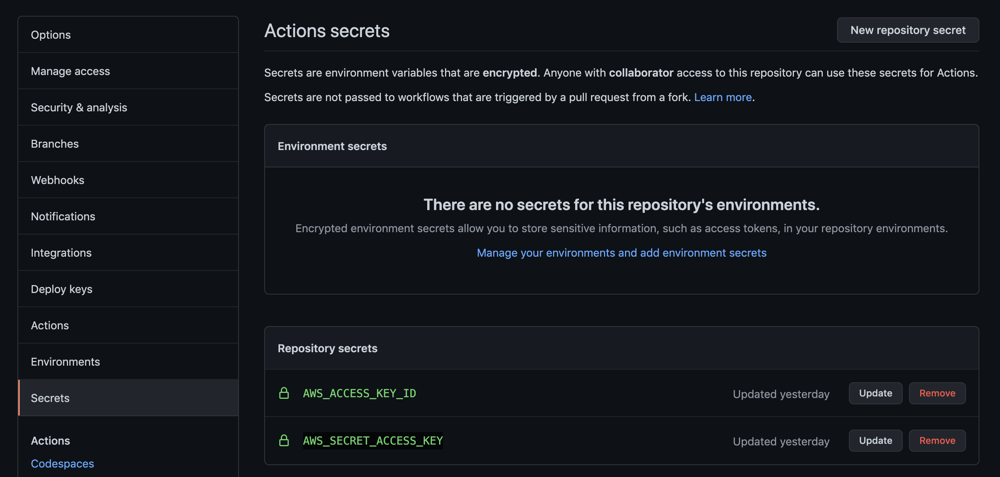

# <b>Elixir API</b>

## <b>Repo description</b>

This repo builds an Elixir with Phoenix docker image ready for serving an API, once a container is deployed from the image.

Once a push to this repo is done, a [Github Action](https://github.com/seavba/elixir-api/tree/main/.github/workflows) runs for building the image and push it to AWS ECR. Action workflow is:

- When a commit is pushed to this repo, it runs a job with the following steps:

  - Checkout the Repo
  - Configure AWS credentials
  - Login to AWS ECR
  - Create ECR repo if it's missing
  - Build and push image

 

#### <b>Key files</b>

<b>Dockerfile:</b> Obviously, the image created is based on the instructions of the Dockerfile. It installs the packages and dependencies for Elixir and copy the files needed for the DB configuration.

<b>Entrypoint.sh:</b> Script for creating database and inserting data, once a container is deployed.

<b>Files directory:</b> Within this directory, can be found:
  - router.ex: File where the API actions are defined
  - seeds.exs: File where some rows in the DB are inserted.

## Getting Started

#### <b>Repo variables</b>

ECR variables must be modified in the [Github Action](https://github.com/seavba/elixir-api/blob/main/.github/workflows/docker-image.yml#L7-L10)

-  aws-region: eu-west-1
-  image_tag: elixir-api
-  ecr_repo: elixir-images-repo

> :warning: In your repsoitory, two secrets must be created:

- AWS_ACCESS_KEY_ID
- AWS_SECRET_ACCESS_KEY

  

No more vars should be modified in this repository in order to preserve the integrity related to https://github.com/seavba/iac-api)

#### How to proceed</b>

- Create your github repository
- Add the AWS secrets as described above
- Clone the repository on your local machine
- Modify the variables as described above
- Push the changes and wait for the Github action 

#### <b>Webgraphy</b>

- [API example](https://itnext.io/building-apis-with-phoenix-framework-a7e280b7fa4a). Thanks to @diogosouza
